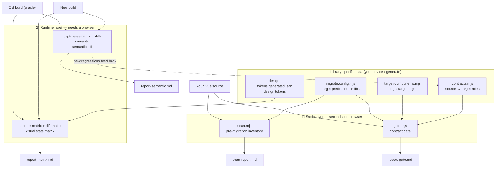

# component-migration-toolkit

Migrate a Vue app from one component library to another (e.g. **Angular + DevUI / Element Plus → Vue 3 + your UI library**) with two complementary safety nets:

| Layer | Tool | Files | What it does | Cost |
|---|---|---|---|---|
| Static | **Contract gate** | `gate.mjs` + `contracts.mjs` | Parse `.vue` ASTs and flag **wrong / missing / truly-absent** mappings (e.g. a tree missing `:props`, an advanced-search missing `:fields`, leftover source-library tags) | Seconds, no browser |
| Runtime | **Semantic diff** | `capture-semantic.mjs` + `diff-semantic.mjs` + `journey.mjs` | Drive both builds, compare the **a11y tree + network + interactions + console**, using the old build as an oracle to catch behavioral regressions across frameworks | Needs a browser |

Two more optional tools:

- **Pre-migration inventory** — `scan.mjs` + `target-catalog.mjs`: enumerate source-library usage and classify each into *exact map / semantic candidate / truly missing / third-party*.
- **Visual state matrix** — `capture-matrix.mjs` + `diff-matrix.mjs` + `design-tokens.mjs`: walk *route × element × interaction-state* and classify visual changes into *regression / review / expected (matches design tokens)*.

> The engines are **library-agnostic**. Everything specific to *your* target library lives in a few data files you generate/edit: `migrate.config.mjs`, `contracts.mjs`, `target-components.mjs`, `design-tokens.generated.json`. The versions committed here are **neutral examples** using the `ui-` prefix and Element Plus (`el-`) as a source.

---

## Architecture

The static layer is a cheap **floodlight** (scan everything, flag suspects); the runtime layer is **precise strikes** (drive real pages, verify behavior). Regressions found at runtime get encoded back into contracts so the static gate catches them next time.



**Data flow in one line:** the `.vue` files a report flags → map to a route → run the runtime diff on that page; new runtime findings → add a contract → the static gate catches them for free next time.

---

## Install

```bash
npm i                                # @vue/compiler-sfc + playwright
npx playwright install chromium      # only needed for the runtime tools
```

The static gate/scan need **only** `@vue/compiler-sfc` (no browser).

## Quick start (self-test)

```bash
node gate.mjs __selftest__
```

Expected: `契约自检 ✓ …` then **2 errors + 2 warnings** against `__selftest__/bad.vue`
(missing `:fields`, a truly-absent `el-card`, a tree missing `:props`, a leftover `d-button`).

## Adapt it to your library

1. **Set your target prefix** in `migrate.config.mjs` (e.g. `targetPrefix: 'y'` if your components render as `<y-button>`), and list your source-library prefixes.
2. **Generate the real component list** so the gate can self-check contract targets:
   ```bash
   node extract-components.mjs "node_modules/@scope/your-ui"   # → overwrites target-components.mjs
   ```
3. **Write contracts** in `contracts.mjs` — one entry per `source → target` with any required props. Only encode constraints you have verified from the target library's source/types.

## Full workflow

```bash
# 1) Static gate — scan everything, cheap
node gate.mjs "/path/to/your/src"          # → report-gate.md

# 2) Semantic diff — targeted, old build as oracle
node explore.mjs http://old/login          # print a11y tree to copy into journey.mjs
node capture-semantic.mjs http://old/page old
node capture-semantic.mjs http://new/page new
node diff-semantic.mjs old.json new.json   # → report-semantic.md

# 3) Fix, then re-run both until clean.
```

New regressions the semantic diff catches but the gate missed → encode them back into `contracts.mjs`, so next time the static gate catches them for free.

See [`docs/contract-gate.md`](docs/contract-gate.md) and [`docs/semantic-diff.md`](docs/semantic-diff.md) for details.

## Repo layout

```
migrate.config.mjs          # central config: target prefix, source libs, third-party prefixes
contracts.mjs               # source → target migration contracts (EDIT THIS)
gate.mjs                    # static contract gate
scan.mjs / target-catalog.mjs   # pre-migration inventory + semantic matcher
extract-components.mjs      # generate target-components.mjs from your library
target-components.mjs       # legal target tags (EXAMPLE — regenerate)
capture-semantic.mjs / diff-semantic.mjs / explore.mjs / journey*.mjs   # runtime semantic diff
capture-matrix.mjs / diff-matrix.mjs / matrix.config.mjs                # visual state matrix
extract-tokens.mjs / design-tokens.mjs / design-tokens.generated.json   # design-token classifier
__selftest__/               # fixture for `gate.mjs __selftest__`
examples/                   # sample reports + a self-contained semantic-diff simulation
docs/                       # per-tool docs
```

## Browser

Runtime tools default to Playwright's bundled Chromium. To use a system browser instead, set `PW_CHANNEL=chrome` (or `msedge`).

## Notes / gotchas

- Prefer `node gate.mjs "path"` over `npm run gate -- path` (some shells drop the `--` args and scan the current directory).
- Semantic-diff network checks need `http(s)` (a `file://` page can't observe `/api` calls).
- `extract-tokens.mjs` reads a target-library CSS from `vendor/target-ui.css` (bring your own; `vendor/` is git-ignored).

## License

[MIT](LICENSE)

---

## 中文速览

把 Vue 应用从一套组件库迁到另一套的双保险工具集：**静态契约闸门**（改代码前扫 `.vue`，按契约挑出错换/漏配/真缺）+ **运行时语义差异对比**（旧版当基准，比 a11y 树/网络/交互/控制台，抓跨框架行为回归）。另含**迁移前清单**（`scan.mjs`）与**视觉状态矩阵**（`*-matrix.mjs`）。

引擎与具体库无关；库相关的东西集中在 `migrate.config.mjs` / `contracts.mjs` / `target-components.mjs` / `design-tokens.generated.json`，仓库内是 `ui-` 前缀的**通用示例**。

```bash
npm i
node gate.mjs __selftest__                       # 自测：应 2 错 2 警
node extract-components.mjs "node_modules/@scope/your-ui"   # 用你的库生成真实清单
node gate.mjs "你的 src 路径"                      # 静态闸门 → report-gate.md
```

上手细节见 `docs/contract-gate.md`、`docs/semantic-diff.md`。
