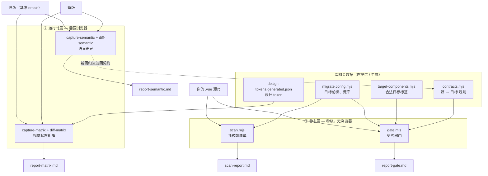

# component-migration-toolkit

[](https://github.com/weijun-xia/component-migration-toolkit/actions/workflows/ci.yml)
[](LICENSE)

[English](README.md) | **简体中文**

把 Vue 应用从一套组件库迁移到另一套（例如 **Angular + DevUI / Element Plus → Vue 3 + 你的 UI 库**），提供两道互补的安全网：

| 层 | 工具 | 文件 | 作用 | 成本 |
|---|---|---|---|---|
| 静态 | **契约闸门** | `gate.mjs` + `contracts.mjs` | 解析 `.vue` 的 AST，挑出**错换 / 漏配 / 真缺**的映射（如 tree 漏配 `:props`、advanced-search 漏配 `:fields`、残留的源库标签） | 秒级，无需浏览器 |
| 运行时 | **语义差异** | `capture-semantic.mjs` + `diff-semantic.mjs` + `journey.mjs` | 驱动新旧两版，比较 **a11y 树 + 网络 + 交互 + 控制台**，以旧版为基准（oracle）抓跨框架行为回归 | 需要浏览器 |

另有两个可选工具：

- **迁移前清单** — `scan.mjs` + `target-catalog.mjs`：枚举源库用法，逐一归类为 *精确映射 / 语义候选 / 真缺 / 第三方*。
- **视觉状态矩阵** — `capture-matrix.mjs` + `diff-matrix.mjs` + `design-tokens.mjs`：遍历 *路由 × 元素 × 交互态*，把视觉变化归为 *回归 / 待确认 / 预期（符合设计 token）*。

> 引擎**与具体库无关**。所有与*你的*目标库相关的东西都集中在几个你生成/编辑的数据文件里：`migrate.config.mjs`、`contracts.mjs`、`target-components.mjs`、`design-tokens.generated.json`。仓库内提交的是使用 `ui-` 前缀、以 Element Plus（`el-`）为源的**通用示例**。

---

## 架构

静态层是廉价的**探照灯**（全量扫描、圈出嫌疑）；运行时层是**精确打击**（驱动真实页面、验证行为）。运行时发现的回归会沉淀回契约，下次静态闸门就能直接抓到。



**一句话数据流：** 报告点名的 `.vue` → 对应到某个路由 → 对那页跑运行时 diff；运行时的新发现 → 加一条契约 → 下次静态闸门免费抓到。

---

## 安装

```bash
npm i                                # @vue/compiler-sfc + playwright
npx playwright install chromium      # 仅运行时工具需要
```

静态闸门/扫描**只**依赖 `@vue/compiler-sfc`（无需浏览器）。

## 快速开始（自测）

```bash
node gate.mjs __selftest__
```

预期：先打印 `契约自检 ✓ …`，再对 `__selftest__/bad.vue` 报 **2 错 + 2 警**（漏配 `:fields`、真缺的 `el-card`、tree 漏配 `:props`、残留的 `d-button`）。

## 适配你的库

1. **设置目标前缀**：在 `migrate.config.mjs` 里改 `targetPrefix`（例如组件渲染为 `<y-button>` 就设 `'y'`），并列出你的源库前缀。
2. **生成真实组件清单**，让闸门能对契约 target 做自检：
   ```bash
   node extract-components.mjs "node_modules/@scope/your-ui"   # → 覆盖 target-components.mjs
   ```
3. **编写契约**：在 `contracts.mjs` 里，每条一个 `源 → 目标` 加上必填 prop。只写你从目标库源码/类型里**确认过**的约束。

## 完整流程

```bash
# 1) 静态闸门 —— 全量扫描，便宜
node gate.mjs "/path/to/your/src"          # → report-gate.md

# 2) 语义差异 —— 定向，旧版当基准
node explore.mjs http://old/login          # 打印 a11y 树，照抄进 journey.mjs
node capture-semantic.mjs http://old/page old
node capture-semantic.mjs http://new/page new
node diff-semantic.mjs old.json new.json   # → report-semantic.md

# 3) 修复，然后两个都重跑到干净。
```

语义差异抓到、但闸门没抓到的新回归 → 写回 `contracts.mjs`，下次静态闸门免费抓到。

详见 [`docs/contract-gate.md`](docs/contract-gate.md) 与 [`docs/semantic-diff.md`](docs/semantic-diff.md)。

## 目录结构

```
migrate.config.mjs          # 中央配置：目标前缀、源库、第三方前缀
contracts.mjs               # 源 → 目标 迁移契约（改这里）
gate.mjs                    # 静态契约闸门
scan.mjs / target-catalog.mjs   # 迁移前清单 + 语义匹配器
extract-components.mjs      # 从你的库生成 target-components.mjs
target-components.mjs       # 合法目标标签（示例 —— 需重新生成）
capture-semantic.mjs / diff-semantic.mjs / explore.mjs / journey*.mjs   # 运行时语义差异
capture-matrix.mjs / diff-matrix.mjs / matrix.config.mjs                # 视觉状态矩阵
extract-tokens.mjs / design-tokens.mjs / design-tokens.generated.json   # 设计 token 分类器
__selftest__/               # gate.mjs __selftest__ 的固定样例
examples/                   # 示例报告 + 自包含的语义差异模拟
docs/                       # 各工具文档
```

## 浏览器

运行时工具默认用 Playwright 内置 Chromium。想用系统浏览器就设 `PW_CHANNEL=chrome`（或 `msedge`）。

## 注意事项

- 优先用 `node gate.mjs "路径"`，别用 `npm run gate -- 路径`（某些 shell 会吞掉 `--` 之后的参数，导致误扫当前目录）。
- 语义差异的网络检查需要 `http(s)`（`file://` 页面观察不到 `/api` 请求）。
- `extract-tokens.mjs` 从 `vendor/target-ui.css` 读目标库 CSS（自备；`vendor/` 已被 gitignore）。

## 贡献

欢迎 Issue 与 PR —— 见 [CONTRIBUTING.md](CONTRIBUTING.md)。请保持提交的数据文件通用（不要放私有组件库数据）。

## 许可证

[MIT](LICENSE)
